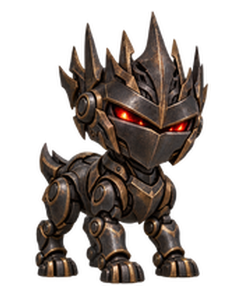
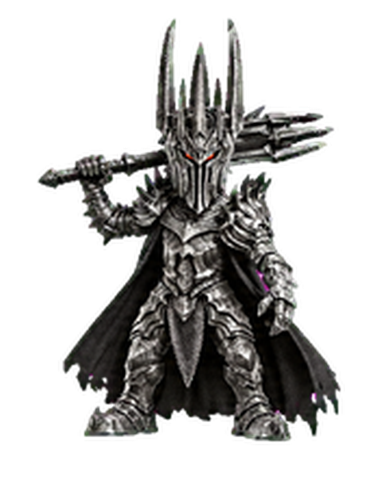

# Codex Custom Pets

Transparent animated companions for ChatGPT Work, with source strips, v2 sprite sheets, motion previews, and QA reports.

<table>
  <tr>
    <th>Grievous Mask</th>
    <th>Sauron</th>
    <th>Sauron (Armored)</th>
  </tr>
  <tr>
    <td align="center"></td>
    <td align="center"></td>
    <td align="center"></td>
  </tr>
</table>

## Pets

| Pet | Description | Pet ID |
| --- | --- | --- |
| Grievous Mask | Bone-white, horned cyborg mask with watchful red eyes | `pet_6abe49473a888191b006b1e2134f59e3` |
| Sauron | Dark-iron spiked helm with an ember-red visor | `pet_6abe517a2fe08191b006b1e2134f59e3` |
| Sauron (Armored) | Dark-armored lord with a towering spiked helm, cape, and greatsword | `pet_6abee113040c8191a4e018abec6cb1f7` |

## Use a pet

### If the pet is already in your account

- In ChatGPT on the web, open **Settings → Personalization → Pet → Select pet**, then choose the pet. It appears in supported ChatGPT Work chats.
- In the ChatGPT desktop app, open your profile menu and choose **Pets**, or open **Settings → Pets**. Choose the pet, then enter `/pet` or use **Show pet** to display it.
- The pet picker changes the appearance of ChatGPT; it does not change how ChatGPT completes tasks.

### Add one from this repository

1. Download the pet's `spritesheet-extended.png` from its folder under [`pets/`](pets/).
2. In ChatGPT, open **Settings → Personalization → Pet** and choose **Upload pet** if that option is available for your account and surface.
3. Follow the file requirements shown in ChatGPT, then select the uploaded pet.

These sprite sheets use the v2 layout at 1536 × 2288 pixels. The official Pets documentation currently lists the web upload layout as 1536 × 1872 pixels, so some upload surfaces may not accept these v2 files directly. Check the [current Pets instructions](https://learn.chatgpt.com/docs/pets) for the surface you use. The Pet IDs in this table identify pets in the original owner's account; they do not import a pet into another account.

## Files

- `pets/<pet>/spritesheet-extended.png` — final transparent v2 sprite sheet
- `pets/<pet>/source/` — canonical base, generated strips, and included reference art
- `pets/<pet>/previews/` — contact sheet, per-state GIFs, look-direction loop, and MP4
- `pets/<pet>/qa/` — validation, motion, direction, and continuity reports
- `skills/create-pet/` — backup of the pet creation skill and its bundled scripts
- [`AGENTS.md`](AGENTS.md) — repository maintenance and push process

The README portraits in `images/` are transparent PNGs derived from each pet's first idle frame.
